# iMark 功能示例

这是一段普通的段落，包含 **粗体**、*斜体*、~~删除线~~、==高亮== 和 `行内代码`。还有一个 #标签 与 #tag/nested。

这里有一个 [外部链接](https://obsidian.md "Obsidian") 和一个 [[Another Note|内部链接]]，还有一个未解析的 [[Missing Note]]。裸链接 https://typora.io 也会被识别。行内公式 $E = mc^2$ 与脚注[^1]。

> [!tip] 提示
> Callout 会在光标离开时渲染为卡片，点击即可回到源码编辑。
> 支持 **嵌套 Markdown**、`代码` 与列表：
> - 第一项
> - 第二项

> [!warning]- 可折叠的警告
> 默认折叠，点击标题展开。

## 列表与任务

- 第一层列表项
  - 第二层列表项，文字足够长的时候会自动换行并保持悬挂缩进，看看效果如何吧这里再加一些文字让它换行。
    - 第三层
- 另一个项目

1. 有序列表
2. 第二项
   1. 嵌套有序

- [ ] 待办事项
- [x] 已完成事项
- [ ] 再来一个 [[Deep Note]]

## 引用

> 引用块第一行
> 引用块第二行
>
> > 嵌套引用

## 代码

```ts
export function hello(name: string): string {
  // greet
  return `Hello, ${name}!`;
}
```

```python
def fib(n):
    return n if n < 2 else fib(n - 1) + fib(n - 2)
```

## 表格

| 功能 | 状态 | 备注 |
| :--- | :---: | ---: |
| Live Preview | ✅ | 类 Typora / Obsidian |
| 主题 | ✅ | 直接加载 **Obsidian** 主题 |
| 数学公式 | ✅ | KaTeX |

## 数学

$$
\int_{-\infty}^{\infty} e^{-x^2} \, dx = \sqrt{\pi}
$$

## 图片与嵌入


![[imark.png|80]]

![[Another Note]]

---

%% 这是一个注释，在实时预览中不可见 %%

<div style="padding:8px;border:1px dashed gray;border-radius:6px">原始 <b>HTML</b> 块</div>

最后一段。

[^1]: 这是脚注内容。

## Mermaid 图表

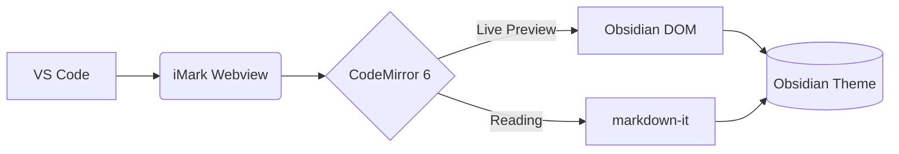

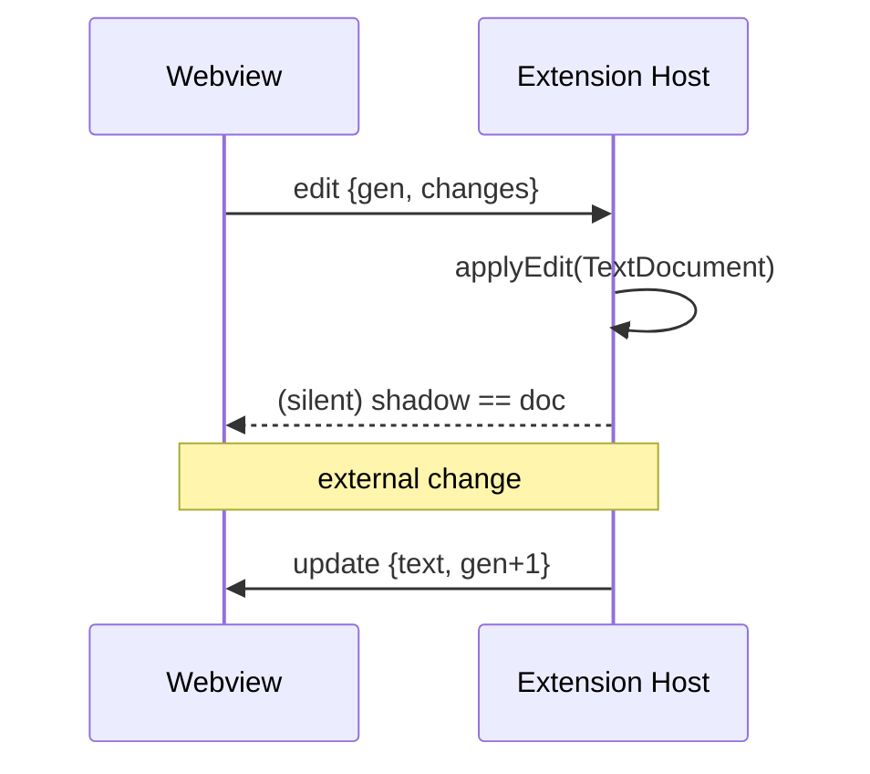

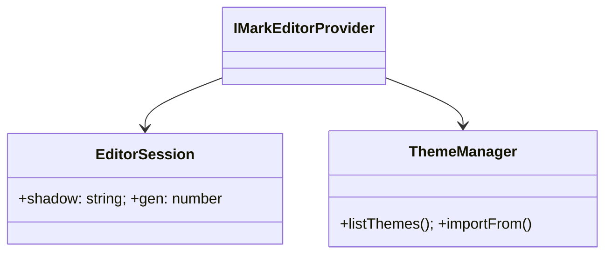

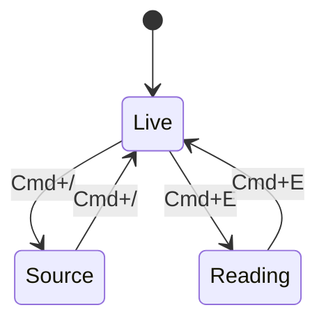

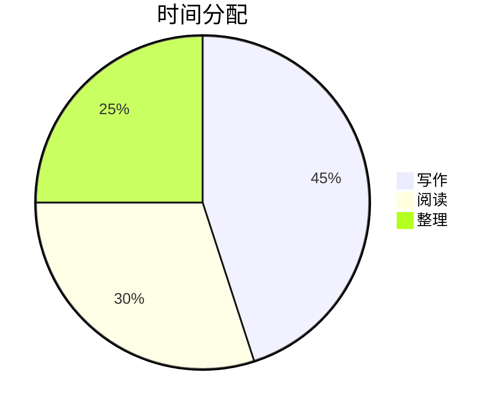

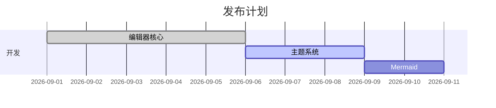

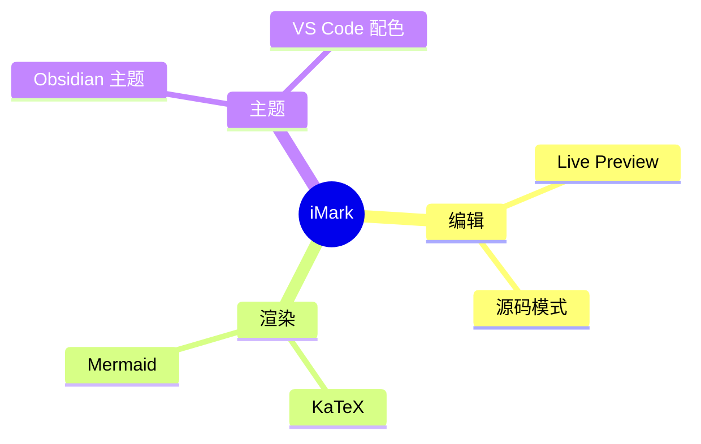

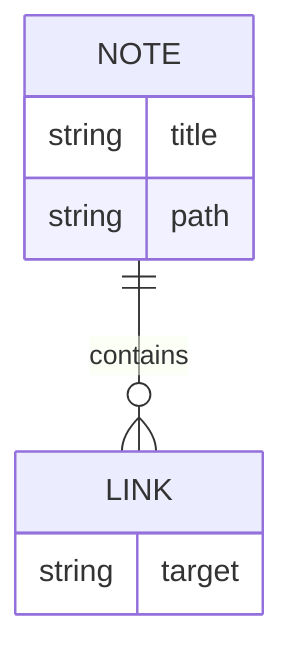

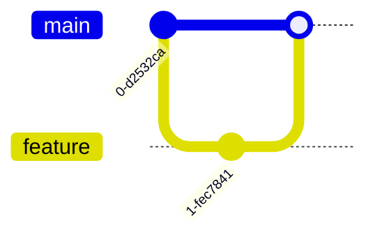

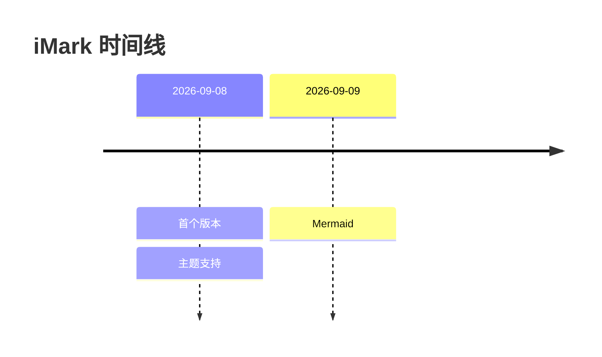

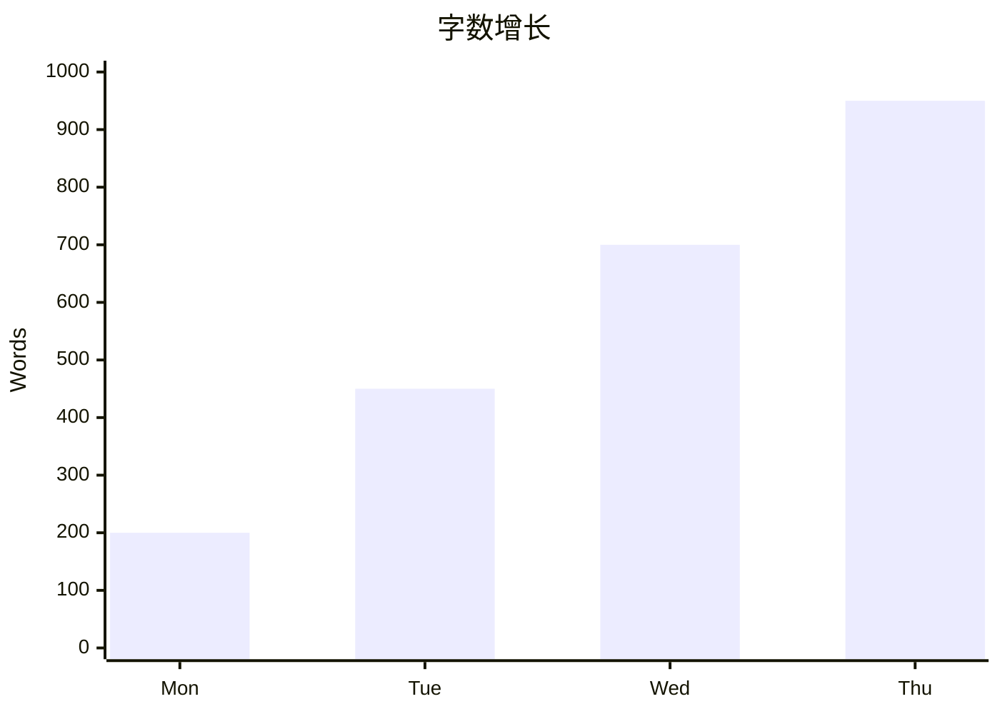

```mermaid
this is not valid mermaid
```

## 宽表格

| 模块 | 职责 | 关键文件 | 说明 |
| --- | --- | --- | --- |
| Extension host | 注册 CustomTextEditorProvider，维护 shadow 文档并把 Webview 的增量修改应用到 TextDocument，同时把外部修改以最小 diff 回推 | `src/extension/editorProvider.ts` | 使用 `normalizeEol(document.getText()) === shadow` 判断是否为自身修改 |
| Webview | 运行 CodeMirror 6，生成与 Obsidian 兼容的 DOM 结构，负责 Live Preview 装饰、块级 widget（表格、Callout、公式、Mermaid）与阅读视图渲染 | `src/webview/main.ts`, `src/webview/editor/*.ts` | https://codemirror.net/docs/ref/#view.EditorView |
| Theme library | 导入 Obsidian 主题、片段与外观配置到 globalStorage | `src/extension/themeManager.ts` | 选择保存在 `imark.theme.name` |

| 短 | 表 |
| --- | --- |
| a | b |
